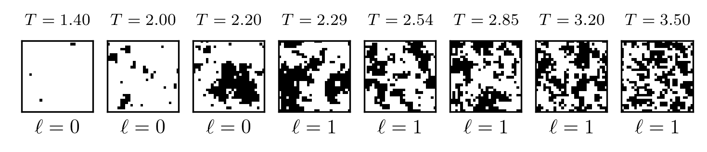

# Organizer Guide

## Summary
As the organizers, your task is to coordinate all the high-level aspects of a virtual science forum.



This page provides helpful guidelines and checklists to ensure an as-smooth-as-possible experience for yourself, but also for all of the participants, speakers and moderators.

## Download
This file can be downloaded as a PDF, perhaps. 


## Datasets
Below are datasets with various system sizes in the `.npy` format, for easy use in python.

| Name  	|  Size 	|  MD5 Checksum  	|
| :--- | :---: | :--- |
| [ising-28x28-npy.tar.gz](https://github.com/quantumdata/data/releases/tag/v0.1-ising-npy) | 6.6MB  	| e933f050f6b2bcc5d20595a3f8a74744  	|
| [ising-32x32-npy.tar.gz](https://github.com/quantumdata/data/releases/tag/v0.1-ising-npy)  | 8.6MB  	| 3032be59ab009080b69117ff5bece567  	|
| [ising-48x48-npy.tar.gz](https://github.com/quantumdata/data/releases/tag/v0.1-ising-npy)  | 19MB  	| bb6e72b74a45427abea53996d05753bf  	|
| [ising-64x64-npy.tar.gz](https://github.com/quantumdata/data/releases/tag/v0.1-ising-npy)  | 34MB  	| 7cf378e17b5b7e2316e6611f2b759652  	|

See [alternative formats](#alternative-formats) for other data formats.

## Dataset layout
Each compressed zip file contains multiple python archives, one with the snapshots and a separate one with labels. The following script shows how to load both:

```python
import numpy as np
snapshots    = np.load("ising-28x28.npy")
labels       = np.load("ising-28x28-lbl.npy")
phases       = labels[:,0]
temperatures = labels[:,1]  # = np.arange(1,3.55,0.05) (reversed)
```

The temperatures in the dataset range from $T=1$ to $T=3.5$ in $51$ steps of size $0.05$, and each temperature has $1,000$ samples. The phase label takes values $0$ and $1$. The temperature closest to the transition temperature in the thermodynamic limit is $2.25$.

## Descriptions
Each pixel in a snapshot represents a little magnetic arrow (a.k.a a *spin*) variable, pointing either up (black, value +1) or down (white, value -1). These spins interact with their nearest neighbors, and try to align themselves. This alignment is only perfect at very small temperatures, resulting in a ferromagnetic system (phase label $\ell = 0$). As the temperature increases beyond critical ($T_c = 2.269$), thermal fluctuations prevent the alignment and the system transitions into a paramagnetic system (phase label $\ell = 1$) where spins point up & down randomly.

The data has been labeled according to the transition temperature of the thermodynamic limit.

## Example dataset uses

Various machine learning analyses are possible on this dataset. Two highlights, each with different goals, are:
* Learning to classify the snapshots into phase 0 or phase 1, with the goals of either extracting an [order parameter](https://en.wikipedia.org/wiki/Phase_transition#Order_parameters) or finding the [transition point](https://en.wikipedia.org/wiki/Phase_transition).
* Learning the partition function (see [here](https://en.wikipedia.org/wiki/Partition_function_(statistical_mechanics)) $P(\textrm{configuration})$ using unsupervised methods.

Give the [Challenge](#Challenge) below a go too.

#### Phase classification results

##### Unsupervised (PCA)
Unsupervised methods can be used to separate the two classes, see e.g. [this reference](https://arxiv.org/abs/1606.00318). A principal component analysis (PCA) works for this dataset, because the two phases are separable with a *linear& transformation. The dominant principal component corresponds simply to the intensity (~magnetization) of the snapshot, as the panel with normalized component 1 shows in the figure below.


##### Supervised Learning
This model serves as a simple toy model for classifier architectures targeted at physical models. Many networks perform well on the dataset. Example works [here](https://arxiv.org/abs/1605.01735) or [here](https://arxiv.org/abs/1610.02048) illustrate some (semi-)supervised uses of this model.

We repeat the essence of [this work](https://arxiv.org/abs/1605.01735) here, by defining a simple feed-forward net: a single layer fully connected neural net with ~100 hidden units with ReLU activation, dropout regularization, and softmax. This model performs quite well; you should be able to obtain over 90% accuracy on our test-sets.

The figure below illustrates this in two ways. In the *rightmost* panel, we evaluate the model's label prediction by comparing the predicted label directly to the target label and record the accuracy of that prediction, for each temperature, averaged over the 1000 snapshots at that temperature. On the left we show to sets of curves: one with the accuracy of the networks' prediction of the label 0, and similarly for the prediction of label 1. Both of these show a drop in accuracy at the transition point.


### Challenge
The above shows that supervised training is capable of classifying the data. The goal of this dataset in physics is to extract an as-accurate-as-possible transition temperature from a dataset, whilst assuming as little as possible about the correctness of the labels. As a challenge, restrict yourself to use only the data at temperatures below $T=1.5$ and above $T=3.0$, and see if you can use your model to evaluate the data at intermediate temperatures and extract the critical temperature.

## Alternative formats
We provide alternative data formats for users not using `numpy` or python. For this model, plain text files are available [here](https://github.com/quantumdata/data/releases/tag/v0.1-ising-txt) Note that `.npy` tends to be faster in python even if you don't plan on using `numpy` itself, not to mention the much smaller filesize.

## More information
### Model history
In the 1920s, the idea of magnetism, particularly ferromagnetism, was beginning to be closely studied. Physicist Wilhelm Lenz proposed a mathematical model to his then student Ernst Ising (pronounced *EE-ZING*), to describe a system of spins which compose a ferromagnet. The microscopic configuration of such spins determine important physical properties of the material as a whole.

One of the questions of interest for a model like the Ising model is what are the physical properties and how do they arise. Given certain parameters what configurations is the model likely to take on, and what sorts of values should we expect for the observable quantities this model produces. For example, quantities of interest include the magnetization, average configuration energies, specific heat, etc. The other question we naturally should ask is given the set of physical observables, is it possible to determine which state the system originated from? If this is possible, by looking at the output of a neural network trained to recognized states, we can look at discontinuities when the network predicts one phase versus another.

### Physical Observables of the Ising Model

We can define the model of the configurations of Ising states. Let $\Lambda \{ \sigma_1, \sigma_2, ... \sigma_L \}$ be a set of size $L$ of interacting lattice points. At each site $i$, we have a spin $\sigma_i$ which can be either up or down, $\sigma_i \in \{ -1, +1 \}$. Spins at lattice points $i,j$ interact with interaction strength $J$. We also place the model in an external field $h$. In order to describe the system, we introduce the Hamiltonian which governs the energy of the system:

$$\begin{aligned}
  H = -J\sum_{\langle i,j \rangle} \sigma_i\sigma_j-h\sum_j \sigma_j
\end{aligned}$$

The notation $\langle i,j \rangle$ denotes nearest neighbours only. Since we have analytic solutions for the partition function, we can also calculate exact values of observables, including energy, specific heat, magnetization, and magnetic susceptibility. We can plot the real values from the dataset against theoretical values.


*Note that the size 28x28 system sizes suffers from finite size effects particularly in the magnetism*

The thick yellow line represents exact calculated values. There is a noticeable discrepancy in the magnetism, since the calculated values are for the theoretical limit of an infinite system size. A finitely sized system can only approach the non-analytical cusp.

There is a clear distinction between the two phases indicated by a sharp cusp in the magnetism, and divergence in the specific heat and magnetic susceptibility. These are values that can be analytically calculated, since the Ising model has an analytic solution, but not all models do.
