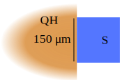

# Andreev reflection in quantum Hall systems: 2021 state of the union 
**December 9 2021**

{ width=80% }

A combination of superconductivity with quantum Hall effect allows perfectly nonlocal crossed Andreev reflection, which has made it a target of experimental search for more than a decade.

Due to progress in material physics and emergence of new hybrid platforms, this search has resulted in a series of
experiments observing a combined effect of chiral edge states and superconductivity.
At the same time, measurements of Andreev conductance in the quantum Hall regime demonstrate wildly different behaviors,
sometimes in disagreement with existing theoretical predictions.

In this workshop we aimed to bring together experts working in the field, review observations and their interpretation, and identify the possible ways forward.

## Workshop summary

Combining Andreev reflection with chiral movement of electrons is an open topic of experimental search and theoretical ideation for more than two decades. While the low magnetic field regime has been observed and offers a clear interpretation, the limit of full Landau quantization has only recently become available to experiments. There are two prominent predicted manifestations of Andreev reflection in the quantum Hall regime. 1) The supercurrent in the chiral regime acquires the Aharanov-Bohm periodicity for magnetic flux penetrating the normal region. 2) A single superconducting electrode enables injection of holes into the downstream current and, in lattice-matched graphene, generates a quantized negative nonlocal resistance. While the supercurrent signature remains unseen, nonlocal resistance measurements finding negative values (with mysteries) feature prominently in recent experimental works. For the overview see Carlo Beenakker's talk [below](#the-search-for-chiral-andreev-edge-states).

The three experiments of the workshop used different material platforms and geometries summarized in the table below. The experiment presented by Gleb Finkelstein observed chaotic conductance oscillations that rapidly decay with the loss of phase coherence. This result and the authors' interpretation agree with recent [numerical simulations](#mechanisms-of-andreev-reflection-in-quantum-hall-graphene) and the [analytical theory](#mesoscopic-conductance-along-the-proximitized-quantum-hall-edge) presented in the satellite talks. This data also exhibits jumps with magnetic field, consistent with the [analysis](#mesoscopic-conductance-along-the-proximitized-quantum-hall-edge) of the effect of vortex entrance. The other two experiments demonstrate a systematically negative downstream resistance with no apparent mesoscopic fluctuations. The results reported by Onder Gul extend to the fractional quantum Hall regime, that was analysed by the authors using the renormalization group approach as well as in one of the [satellite talks](#induced-superconductivity-in-fqh-edges-in-presence-of-dissipation). The reasons for the difference in the observations are as yet unknown. In addition to these works, the [experiment](#longitudinal-resistance-oscillations-in-insbas-2degs-in-a-quantum-hall-regime) reported by Ivan Kulesh, observed fluctuations in the downstream resitance interpreted as tunneling through the quantum Hall bulk—a phenomenon that may complicate the analysis of Andreev reflection in small samples (relevant to the experiments presented by Onder and Gleb).

| [Speaker](talk link), Reference | Onder Gul, [arXiv:2009.07836](https://arxiv.org/abs/2009.07836), [arXiv:1609.08104](https://arxiv.org/abs/1609.08104)  | Gleb Finkelstein, [arXiv:1907.01722](https://arxiv.org/abs/1907.01722)   | Javad Shabani, [arXiv:2108.08899](https://arxiv.org/abs/2108.08899)  | 
| - | - | - | - | 
|**Top-down**   |  |   |   | 
| **Cross-section**  |  |  |  |
| **Materials**   |Graphene, NbTiN | Graphene, MoRe | InAs 2DEG, NbTiN |
| **Main observations**   ($R$ is nonlocal voltage divided by drain current)| $R \approx \textrm{const}< 0$ for integer and fractional QHE; $R \to 0$ at $W \gtrsim 0.2\mu\textrm{m}$ | Oscillatory $R$, $\langle G \rangle = 0$; $\textrm{var}(R) \to 0$ with $T\gtrsim 0.2K$; sudden jumps in $R(B)$ | $R \approx \textrm{const} < 0$ in integer QHE plateaus; $R <0$ persists to $I \gtrsim 5\mu\textrm{A}$ | 

Between the seminars and the discussion session, a number of open questions, needed experiments, and needed theory, were identified.

### Open questions

1. What is the nature of the persistent negative nonlocal resistances in the measurements presented by Onder and Javad?
2. Is it possible to experimentally observe the influence of valley physics in the graphene versions of these systems?
3. Are the differences in contact types (edge contact for graphene, planar proximitization for InAs) important? Relatedly, what about the difference between a soft and hard edge potential in the NS contact region?
4. Can the negative influence of the superconducting vortices be eliminated in the experiment?
5. Can the systematic difference between Andreev and normal reflections be explained by the breaking of particle-hole symmetry by the finite bias?

### Ideas for further experiments

1. Noise measurement to reveal the charge of the Andreev reflected holes.
2. Tunneling into the possible zero mode at the end of the finger in the geometry presented by Onder. 
3. Quantum point contact at QH-superconductor interface. 
4. Chicken-wire patterns for superconducting films to minimize the presence of vortex normal cores.
5. Chern insulator normal regions for low-external-field versions of these experiments. 
6. Type-II superconductors with high Hc1 so that QH develops before vortices.

## Workshop videos

#### The search for chiral Andreev edge states
**By [Carlo Beenakker](https://www.lorentz.leidenuniv.nl/beenakker/), Leiden University**  

<iframe width="700" height="400" src="https://www.youtube-nocookie.com/embed/xPlPz1a5Zq8" frameborder="0" allow="accelerometer; autoplay; encrypted-media; gyroscope; picture-in-picture" allowfullscreen></iframe>

??? summary "Video minutes"
  
    - [time=0:01:31] Skipping-orbits for both electrons and holes are in the same direction (opposite sign of both charge and mass). Expt. [10.1103/PhysRevB.76.115313](https://journals.aps.org/prb/abstract/10.1103/PhysRevB.76.115313)  
    
    - [time=0:04:52] Chiral modes don't necessarily transport a unit of charge. The transferred charge can even be zero.
    
    - [time=0:05:31] The early works in the field are in "skipping orbit" limit. It is important to reach the single Landau level regime.
    
    - [time=0:07:19] In graphene, Andreev reflection switches the valleys. Furthermore, the lowest Landau level in graphene is valley polarized. Therefore, there is no electron-hole conversion when the superconductor covers a single edge.
    
    - [time=0:07:19] Valley polarization sets a selection rule for Andreev processes in graphene.
    
    - [time=0:07:19] A two-terminal setup is considered in the theoretical work, while a three-terminal setup in the experiment. For a clean interface, quantized conductance is expected [[arXiv:cond-mat/0612698](https://arxiv.org/abs/cond-mat/0612698)]. In the experiment, conductance is not quantized and has irregular fluctuations [[arXiv:1907.01722](https://arxiv.org/abs/1907.01722)].
    
    - [time=0:10:08] Interface disorder plays a major role [[arXiv:2103.06722](https://arxiv.org/abs/2103.06722)]. Not as universal as one would desire.
    
    - [time=0:12:10] Chiral Andreev edge modes can carry supercurrent in a two-terminal Josephson junction setup.
    
    - [time=0:13:53] For a squid ring, $4\pi$-periodicity in flux difference ($\delta \phi$) in the critical current is expected (so-called $4\pi$ periodic Fraunhofer oscillations). But, in the experiment by [Amet et al. Science  352, 966 (2016)](https://www.science.org/doi/abs/10.1126/science.aad6203), period-doubling is not observed.
    
    **Questions period**
    
    - [time=0:16:53] Q (Yoichi Ando): In these experiments, how do we consider spins? 
        A: For odd filling factor, spin-orbit coupling is critical for Andreev reflection processes (for odd filling factor). The reason is that spin-polarized edge states are not supposed to feature Andreev reflection.
    
    - [time=0:18:16] Q (Leonid Glazman): Remarks that there were earlier experimental works than the one presented by Carlo.
    
    - [time=0:19:13] Q: Referring to slide 3 of Carlo's talk: in the bottom left picture, it really depends on the deatils of the lattice because the boundary. Could one deform the top in the bottom picture? Is there any intermediate point? See Figure 1 from [arXiv:cond-mat/0612698](https://arxiv.org/abs/cond-mat/0612698) 
        A: In general, any graphene edge behaves as zigzag in long lengthscales ([arXiv:0710.2723](https://arxiv.org/abs/0710.2723)), which means that valley is a good quantum number. Thus, isospins in different edges can only be paralell or anti-parallel. What really matters is that if you cover a single edge or two edges.
      

#### Crossed Andreev reflection in fractional quantum Hall graphene devices
**By [Önder Gül](https://kim.physics.harvard.edu/people/onder-gul), Harvard University**  

Based on [arXiv:2009.07836](https://arxiv.org/abs/2009.07836) and [arXiv:1609.08104](https://arxiv.org/abs/1609.08104)   

<iframe width="700" height="400" src="https://www.youtube-nocookie.com/embed/9q16y_W30UU" frameborder="0" allow="accelerometer; autoplay; encrypted-media; gyroscope; picture-in-picture" allowfullscreen></iframe>

??? summary "Video minutes"

    - [time=0:02:50] The valley number is not a good quantum number for the disordered edges.

    - [time=0:05:31] CAR process at odd filling factors is only possible via spin-orbit coupling.

    - [time=0:06:24] Superconducting pairing was observed in the spin-polarized channel. Thus, edge states must couple with their counter-propagating partners at the other side of the superconductor (SC) finger.

    - [time=0:05:58] CAR probabilities for integer filling factors do not change with external magnetic field.

    - [time=0:08:12] Fermi level mismatch is unavoidable.

    - [time=0:08:12] Local gate close to the SC finger was used to change the filling factor in the vincinity of the SC.

    - [time=0:11:43] Particle-like fractional, *e.g.* $\nu=1/3$, quantum Hall edge states have enhanced Andreev signal as magnetic field increase. Integer fillings don't change. Fractional and integer states also show different temperature behaviour.

    - [time=0:15:53] 
        - Control experiment 1: gold finger. No negative signal.  
        - Control experiment 2: wider finger. No negative signal as well. 
        - Control experiment 3: longer finger. Negative resistance is still observed.

    - [time=0:17:52] Disorder limits CAR probability, due to the direct tunneling. Vortices should also limit CAR probability.

    - [time=0:19:12] Future experiments: 
        - Noise measurement to reveal the charge of the Andreev reflected holes. 
        - Tunneling into the zero mode at the end of the finger.

    - [time=0:19:55] Non-saturating temperature dependence for fractional fillings.

    **Questions period**

    There were no questions due to time limitations.

#### Supercurrent and Andreev edge states in the quantum Hall regime
**By [Gleb Finkelstein](http://webhome.phy.duke.edu/~gleb/), Duke University**  

Based on [arXiv:1901.05928](https://arxiv.org/abs/1901.05928) and [arXiv:1907.01722](https://arxiv.org/abs/1907.01722)   

<iframe width="700" height="400" src="https://www.youtube-nocookie.com/embed/Hy8JMaslZLw" frameborder="0" allow="accelerometer; autoplay; encrypted-media; gyroscope; picture-in-picture" allowfullscreen></iframe>

??? summary "Video minutes"

    - [time=0:01:41] The current understanding of the supercurrent is separate Andreev bound states (ABSs) along each edge, as opposed to previous hypothesis based on chiral Andreev edge states.

    - [time=0:01:41] Electrostatics close to the edges of the sample are controlled by side gates, which changes the filling factor at the edges.

    - [time=0:07:00] No periodic signal as long as charge density monotonically decreases close to the edge.

    - [time=0:07:54] Second gate: periodic pattern of critical current, $I_c$, vs. magnetic field, $B$, indicating SQUID geometry between two opposite edges.

    - [time=0:08:42] Andreev edge states are not involved in generation of the supercurrent.

    - [time=0:10:04] Downstream longitudinal resistance ($R_{xx}$) and conventional Hall resistance are measured. $R_{xx}$ decays to zero with increasing temperature, recovering conventional QH behaviors.

    - [time=0:10:15] Negative downstream resistance ($R_{xx}<0$) observed for $\nu=1$.

    - [time=0:12:39] Changing the ground to a metallic contact recovers the expected zero downstream resistance in the absence of a superconductor.

    - [time=0:13:23] The downstream resistance is positive for electrons and negative for holes. The measured $R_{xx}$ signal depends on the wavelength difference of the two chiral Andreev edge states. $V_\mathrm{gate}$ changes the wavevector, leading to an oscillatory behavior.

    - [time=0:16:30] Changing bias voltage also leads to oscillations because the momentum difference of chiral Andreev edge states changes with energy.

    - [time=0:18:35] Abrupt switching with magnetic fields is caused by vortices . Zooming in, one can see regions between the abrupt transitions that are smooth. (See also [Vladislav Kurilovich talk](https://www.youtube.com/watch?v=y0RkSdphwh4).)

    - [time=0:20:44] On average, the system is neutral as can be seen from the longitudinal resistance statistics. See Figure 2c from [arXiv:1907.01722](https://arxiv.org/abs/1907.01722)) 

    - [time=0:21:43] If there are vortices (being sinks for quasiparticles) in the superconductor, then the signal is suppressed.

    - [time=0:21:43] The signal decays as the superconducting contact length is increased, due to dephasing.

    **Questions period**

    There were no questions due to time limitations.

#### Integer quantum Hall effect with a superconducting contact
**By [Javad Shabani](https://wp.nyu.edu/shabanilab/), New York University**  

Based on [arXiv:2108.08899](https://arxiv.org/abs/2108.08899) and ongoing work

<iframe width="700" height="400" src="https://www.youtube-nocookie.com/embed/f6KXtKp8mJo" frameborder="0" allow="accelerometer; autoplay; encrypted-media; gyroscope; picture-in-picture" allowfullscreen></iframe>

??? summary "Video minutes"

    - [time=0:01:54] SC and Quantum Hall (QH) physics give rise to Majoranas (integer QH) or parafermions (fractional QH).

    - [time=0:03:39] Disorder in InAs materials is not as large compared to GaAs materials.

    - [time=0:04:27] There is a trade-off between mobility and contact quality. 

    - [time=0:05:17] Measured interface transparency is close to 1.

    - [time=0:05:47] For QH, you also want a SC with a high critical field . One can use NbTiN.

    - [time=0:05:47] Deposition of SC material is done in controlled environment.

    - [time=0:07:03] The normal-superconductor (NS) interface is $150\mu m$ long, much longer than the other works.

    - [time=0:08:21] Negative downstream resistance ($R_{xx}$) due to Andreev reflection.

    - [time=0:09:52] The Hall resistance is recovered if one computes the difference between upstream and downstream resistances. Deviations appear near the transitions between plateaus.

    - [time=0:12:05] Negative downstream signal is suppressed with bias current ($I_{\mathrm{bias}} \sim \mu A$).

    - [time=0:15:57] When the NS interface is not cleaned, QH phase is still visible but the negative downstream resistance is barely seen. On the other hand, for the cleaned samples, the negative downstream resistance regime is clearly visible.

    - [time=0:17:09] Grounding at different contacts leads to nearly the same result.

    - [time=0:18:59] Next step: quantum point contact at SC interface. The same has been done in Charlie Marcus's group.

    **Questions period**

    There were no questions due to time limitations.

####  Panel discussion with speakers and the participants

<iframe width="700" height="400" src="https://www.youtube-nocookie.com/embed/VTIyOI3d5Ms" frameborder="0" allow="accelerometer; autoplay; encrypted-media; gyroscope; picture-in-picture" allowfullscreen></iframe>

??? summary "Video minutes"

    - [time=0:01:51] Q (from Valla Fatemi to Önder Gul): What is the expected or measured Fermi level mismatch between NbN and Au with respect to graphene? 
      A: Fermi level mismatch is known to exist. Accumulation in a region of $\sim 50	nm$. Due to the fabrication, estimations might not be representative. We expect to have accumulation type of mismatch.

    - [time=0:04:24] Q (from Anton Akhmerov to Önder Gul): In the measurement, $R_{xx}$ is about to turn negative at 2K, is that correct? Do you have lower temperature dependence data? Would you expect $R_{xx}$ to turn negative, too? 
      A: $R_{xx}$ seems to be crossing zero. But there are no measurements at lower temperatures for this sample. Numbers were extracted from a bias-dependent measurement. In a different device, at 15 mK, the $R_{xx}$ does not seem to cross zero.

    - [time=0:07:12] Q (from Mohit Gupta to Javad Shabani): In working with InAs with epitaxial coupling to Al, has there been any issues obtaining the interference pattern (Fraunhofer Oscillations) in 2-terminal Josephson junctions? In working with this material we are able to reproduce all the published characteristics except for the interference pattern. Understandably there can be many reasons for this but any insights will be helpful. 
      A: Josephson junction with NbTiN was never done but is a possibility.

    - [time=0:08:16] Q (from Anton Akhmerov to Javad Shabani): Why do you see a more complex pattern of plateaus in the $B$ vs $V_g$ diagram than the usual Landau fan?  
      A: Crossings in LL fan: multi-subbands.

    - [time=0:08:50] Q (from Yuval Ronen to Javad Shabani): InAs is known to have accumalation of charge near the end of the 2DEG. did you try making similar JJ in the QHE to the one Gleb showed? Maybe there is SC currents also between the different SC contacts in the experiment you showed? 
      A: There is, indeed, surface charge accumulation in InAs. However, there is an extra InGaAs layer, so charge distribution is known pretty well. There was no charge accumulation control at the edges of the sample. 
      Q (from Önder Gul to Javad Shabani): Remarks that there will be charge accumulation at the NS interface. 
      A: The structure is somewhat different. There is an InAs pocket which is proximitized by the superconductor. Therefore, 2DEG devices are not that similar to graphene. CQED measurement suggests that InAs density under the superconductor is increased by a factor by 5-10.

    - [time=0:07:12] Q: For Javad Shabani -- the SC contact of the NbTiN is on top of the Al or not? Are you etching with ion milling in-situ? and sputter NbTiN? how do you know when to stop, effect of disorder? From Yuval Ronen 
      A: SC contact (proximity effect?)  from top is better than edge or side contact. 

    - [time=0:11:50] Q: For anyone -- Is there a conceptual difference between a side contact and a top contact, assuming that both work, which one would be better? 
      A: From Onder Gul -- It depends on material combinations and 2DEG properties. Best contact is the one that couples without doping. The interface may become disorder free without Fermi level mismatch. Perhaps a better option is to use vdW superconductor. In this way, the interface may be disorder free. 
      A: From Javad Shabani -- You want strong induced SC and high transparent contact. In InAs at zero field make good transparency contancs. Requires further experiments to say the same at high field. In graphene I don't know what is the transparency at zero field.

    ## Data interpretation

    - [time=0:14:30] Q (to Javad Shabani): – The Harvard experiment observes negative downstream current that grows with smaller filling fraction. Does this also apply to your experiment? 
      A: If you have a well define QH with large gap, large B, this physics manifests better. Best case for $
    u=2$, at 11 T, but then keep in mind that the gap is larger. B-field: tradeoff between large QH gap and large SC gap. Ideally, best gap at lowest density.

    - [time=0:16:30] Q: (from Srijit Goswami to Javad Shabani): For the bias dependence you showed, roughly what values of voltage would the currents correspond to? And how do these voltages compare to the superconducting gap? (Regarding the plot showing resistance as a function of current bias and magnetic field) 
      A: $\sim 100\mu V$

    - [time=0:18:22] Q (from Valla Fatemi to Javad Shabani): In the subtrated $R_U-R_D$ data, there seems to be a systematic deviation between the blue and red curves as a function of gate voltage in the transition between plateaus. Blue is higher to the left and lower to the right of the transition. Is this understood? From Valla Fatemi. 
      A: The simple picture, at QH they match. Before QH state, you have depth and rise, and it alternates. At the edges you have something more complicated, but the observation is correct. Needs further thinking.

    - [time=0:19:39] Q (from Anton Akhmerov to everyone): Can nonchiral edge states play a role in systematically enabling negative current by enabling local Andreev reflection? How can an experiment rule them out? 
      A (Gleb Finkelstein): When you're looking for supercurrent, the two contacts are close. In the Hall bar setup, Andreev states propagate about half micron long. When the distance between contact is longer, the non-chiral just localize in between somewhere. What happens near the contact, is much more difficult to address (perhaps one could control with local gates). Based on what we see, we don't believe there are not many counterpropagating edge states. We cannot exclude additional states near the contact, but probably the number is small. It is very hard to see their presence. 
      A (Lingfei Zhao): Counter propagating edge states probably don't matter in the normal edges because the $R_{xy}$ is still quantized. But at the interface it is hard to check. 
      A: (Önder Gul): Cannot conclude as well. Residual edge from Fermi level mismatch must lead to counter-propagating edge states. 
      A (Javad Shabani): InAs g-factor is really large. Don't know how the edge state resconstruction varies between graphene and InAs. 
      **All in all: hard to conclude anything in the current experiments.**

    - [time=0:28:06] Q (from Anton Akhmerov to everyone): What about bulk conduction? Current through nonequilibrium field distribtuion. 
      A (Javad Shabani): If the gap is contribtuing to conductance, it should show up in the measurement. 
      A (Bertrand Halperin): If you are deep inside the QH state, then transport current is pretty much from the edge. If you map it, indeed there's current in the bulk, but doesn't contribute to transport. We should not care where the current is flowing in microscopic sense.

    ## Theoretical aspects

    - [time=0:31:46] Q (from Anton Akhmerov to Vladislav Kurilovich and Leonid Glazman): You computed Andreev conductance near a superconductor and you observed rapidly fluctuating result. Can you imagine a situation in which this would not be the case and a systematic negative conductance would be expected? 
      A (Vladislav Kurilovich): Answer is no. Javad's data is peculiar. It should exhibit mesoscopic oscillations but there is unexpected persistent negative downstream resistance. 
      A (Leonid Glazman): Proximitization is differnt. In Javad's experiment the InAs is proximitized. In graphene, it's direct contact with the superconductor. 
      R (Anton Akhmerov): There is also a graphene experiment that also observes a systematic negative downstream current. 
      R (Javad Shabani): There is an experiment with larger sample size in which they don't observe negative resistence anymore. 
      Q (Javad Shabani): Why would vortices matter? 
      A (From Glazman): A vortex effectively work as normal island.

    - [time=0:36:12] Q (Philip Kim): A question about the doping ranges. InAs the SC is on top. I wonder if the schematic drawn by Javad holds. 
      A (Javad Shabani): Soft potential vs. hard potential is relevant to this.

    - [time=0:38:03] Q (from Valla Fatemi to Javad Shabani): Any sort of direct experiments about the presence/density/location of vortices in high fields? Have you tried field cooling the sample? From Valla. 
      A: No direct evidence. The vortices don't want to be at the interface. Chicken wire patterns in the superconductor: no qualitative difference when these patterns are added (but context was different).

    - [time=0:39:18] Q (from Antonio Manesco to everyone): In graphene, one could expect constant conductance due to valley selection rule. But, for 2DEGs, one would expect chiral Andreev interference all the way (even without disorder). How to understand constant negative conductance then? From Antonio. 
      R (Anton Akhmerov): As Leonid pointed out, even if the system was clean one would expect an oscillatory signal, not just constant and negative. 
      A (Enrico Rossi): You have vortices as sink for the electrons. You keep losing holes to the vortices. This can explain negative resistance. The superconductor is grounded. The holes don't have the same tendency going to the ground.  
      Q (Anton Akhmerov): Shouldn't the absorption rate be the same for electrons and holes? 
      A (Enrico Rossi): The superconductor is grounded, so it could attract more electrons than holes. 
      A (Leonid Glazman): If DOS is energy-independent, and there is PHS, there shouldn't be no difference expected between electrons and holes. So this is not enough to explain the constantly negative signal. But maybe the non-linearity of the semiconductor dispersion is important. 
      A (Anton Akhmerov): Indeed, the non-linearity could be the reason for such asymmetry. But then the signal should vanish at zero bias. 
      R (Gleb Finkelstein): Positive and negative signals amplitudes are similar (particle-hole symmetric). Survival probablity decays with the length of the interface.

    - [time=0:43:19] Q (from Ivan Kulesh): All experiments have similar scheme of measurements. Both groups (P.K & G.F.) see that increased bias makes signal disappear above the gap. Javad sees negative resistance at 10 mA (100 times of the SC gap). What to expect if Andreev physics did not disappear? 
      A (Javad Shabani): You cannot just insert bias current into the edge states. In our systems, filling factors are high. The excitation energy is $\sim 100 \mu V$.

    - [time=0:49:50] Q (Lingfei Zhao): About the nonlinear dependence of InAs dispersion: could there be a local electric field effect close to the superconductor? 
      A (Anton Akhmerov): Skeptical about the effect to be strong to give negative CAR.

    ## Ideas for further experiments

    - Two similar questions: 
        1. Is it possible to obtain pristine oscillations in CAES using a type-II superconductor having a high Hc1, before magnetic fields when vortices start developing? (from Rajarshi Bhattacharyya) 
        2. For experimentalists – Do you imagine a way to minimize effects of vortices? (from Antonio Manesco) 
        A (Javad Shabani): One idea is the chicken wire patterns to trap vortices. But ideally one wants to work at really small fields. So another idea is to put very thin Al on top of InAs (critical field in Al can reach 4T). Applying out-of-plane field, the superconductor survives. Then one can choose superconductors such as Nb or Ta instead of granular superconductors. In other words: use vertical superconducting contacts.

    - [time=0:54:09] R (Valla Fatemi) - A possible control experiment that simulates low DOS (like vortices) but without AR: use a contact of the material in question tuned by a gate to near a transition to an insulator, where resistance is high and puddles probably dominate to keep things inhomogeneous.

    - [time=1:06:29] Idea from Valla: Chern insulators lessen the need for external magnetic fields, so this is potentially beneficial for avoiding vortices!

## Satellite talks




### {{ talk1.title }}
**By {{ talk1.speaker_name }} ({{ talk1.speaker_affiliation }})**

===! "Video recording"

    <iframe width="700" height="400" src="https://www.youtube-nocookie.com/embed/{{ talk1.youtube_id }}" frameborder="0" allow="accelerometer; autoplay; encrypted-media; gyroscope; picture-in-picture" allowfullscreen></iframe>

=== "Details"

    **Authors:** {{ talk1.authors }}  
    **Preprint:** [arXiv:{{ talk1.preprint }}](https://arxiv.org/abs/{{ talk1.preprint }})

    {{ talk2.abstract | indent(width=4) }}

### {{ talk2.title }}
**By {{ talk2.speaker_name }} ({{ talk2.speaker_affiliation }})**

===! "Video recording"

    <iframe width="700" height="400" src="https://www.youtube-nocookie.com/embed/{{ talk2.youtube_id }}" frameborder="0" allow="accelerometer; autoplay; encrypted-media; gyroscope; picture-in-picture" allowfullscreen></iframe>

=== "Details"

    **Authors:** {{ talk2.authors }}  
    **Preprint:** [arXiv:{{ talk2.preprint }}](https://arxiv.org/abs/{{ talk2.preprint }})

    {{ talk2.abstract | indent(width=4) }}

### Mesoscopic conductance along the proximitized quantum Hall edge
** by Vladislav D. Kurilovich (Department of Physics, Yale University)**

===! "Video recording"

    <iframe width="700" height="400" src="https://www.youtube-nocookie.com/embed/y0RkSdphwh4" frameborder="0" allow="accelerometer; autoplay; encrypted-media; gyroscope; picture-in-picture" allowfullscreen></iframe>

=== "Details"

    **Authors:** Vladislav D. Kurilovich, Leonid Glazman  
    **Preprint:** [arXiv:2201.00273](https://arxiv.org/abs/2201.00273)

### Induced Superconductivity in FQH Edges in Presence of Dissipation
** by Noam Schiller (Weizmann Institute) and Barak A. Katzir (Technion)**

===! "Video recording"

    <iframe width="700" height="400" src="https://www.youtube-nocookie.com/embed/h0rS7TyUUMI" frameborder="0" allow="accelerometer; autoplay; encrypted-media; gyroscope; picture-in-picture" allowfullscreen></iframe>

=== "Details"

    **Authors:** Noam Schiller, Barak A. Katzir, Ady Stern, Erez Berg, Netanel Lindner, Yuval Oreg

## Organizers

[Anton Akhmerov](https://antonakhmerov.org/), TU Delft  
[Valla Fatemi](https://fatemilab.aep.cornell.edu/), Yale University & Cornell University  
[Christian Schoenenberger](https://nanoelectronics.unibas.ch/), University of Basel

If you have any questions, you may reach us via arqh2021@virtualscienceforum.org

### Additional Credits

We would like to thank Isidora Araya, Mert Bozkurt,  Cunxiao Liu, Antonio Manesco, and Juan Torres for their contriubtions of compiling the questions and answers as well as compiling the meeting minutes. 
