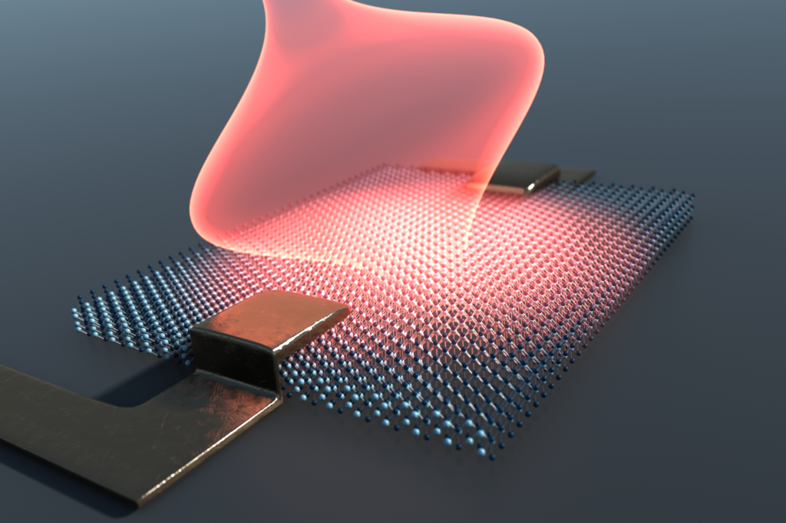


# Floquet Summer School
**<time data-format="MMMM D" datetime="2022-09-13T14:00:00+00:00">September 13</time> and <time data-format="D" datetime="2022-09-14T14:00:00+00:00">14</time> from <time data-format="H:mm" datetime="2022-09-13T14:00:00+00:00">14:00</time> to <time data-format="H:mm" datetime="2022-09-13T17:10:00+00:00">17:10</time>**  
**<time data-format="MMMM D" datetime="2022-09-20T15:00:00+00:00">September 20</time>, <time data-format="D" datetime="2022-09-21T15:00:00+00:00">21</time>, <time data-format="D" datetime="2022-09-14T15:00:00+00:00">22</time> from <time data-format="H:mm" datetime="2022-09-13T15:00:00+00:00">14:00</time> to <time data-format="H:mm" datetime="2022-09-13T17:00:00+00:00">17:00</time>**  
(all times are in UTC timezone)

{ width="600" }

The Floquet Summer School will bring together leading researchers in the field of Floquet quantum systems to provide introductory lectures aimed at graduate students working in the field or interested in learning about it. The lectures will take place online via Zoom.

**To join the meeting, please [register](#registration).**

## Program

### Week 1:

|           | Sep 13 (Tuesday) |       Sep 14 (Wednesday)      |
|-----------|:----------------|:-----------------------------|
| <time data-format="H:mm" datetime="2022-09-13T13:55:00+00:00">13:55</time> | Opening and welcome  |                               |
| <time data-format="H:mm" datetime="2022-09-13T14:00:00+00:00">14:00</time> | Takashi Oka          | Takashi Oka                   |
| <time data-format="H:mm" datetime="2022-09-13T15:00:00+00:00">15:00</time> | Mark Rudner          | Mark Rudner                   |
|           | break (10')          | break (10')                   |
| <time data-format="H:mm" datetime="2022-09-13T16:10:00+00:00">16:10</time> | Xavier Waintal       | Xavier Waintal / Thomas Kloss |

### Week 2:

|           |   Sep 20 (Tuesday)  |  Sep 21 (Wednesday) | Sep 22 (Thursday) |
|-----------|:-------------------|:-------------------|:-----------------|
| <time data-format="H:mm" datetime="2022-09-13T15:00:00+00:00">15:00</time> | Anushya Chandran    | Anushya Chandran    | Mikael Rechtsman  |
| <time data-format="H:mm" datetime="2022-09-13T16:00:00+00:00">16:00</time> | Monika Aidelsburger | Monika Aidelsburger | Mikael Rechtsman  |

### List of lectures:

??? summary "Basics of Floquet engineering of quantum materials *by Takashi Oka*"

    I will give an introductory lecture on the theory of Floquet engineering of quantum materials,
    in which the properties of the system are controlled by time-periodic forces such as laser fields.
    The topics I intend to cover are the following:

    - Floquet theorem
    - Decomposition to stroboscopic- and micro-motions
    - Sambe picture (space-time picture)
    - Effective Floquet Hamiltonian and High-frequency expansion
    - Examples: Dynamic localization, inverted pendulum
    - Graphene in circularly polarized laser (Topology, Floquet spectrum, application of the Sambe picture)
    - Floquet Kubo formula and TKNN formula

??? summary "Topology and non-equilibrium dynamics of Floquet systems *by Mark Rudner*"

     
    Floquet engineering is a powerful technique for eliciting interesting behaviors from quantum many-body systems through time-periodic driving. While the goal in many cases is to use the external drive to get the system to mimic topological or other phenomena known or predicted for equilibrium systems, periodic driving brings a variety of exciting opportunities and challenges for exploring novel regimes of quantum many-body dynamics. In these lectures I will cover the unique aspects of topology in periodically driven systems, which offer new paradigms beyond those of equilibrium topological phases and phenomena. Along the way we will discuss experimental manifestations and open questions, along with theoretical tools and pictures that can provide valuable insight into the intriguing dynamics of interacting, driven systems.

??? summary "Introduction to time-resolved simulations in quantum nanoelectronics *by Xavier Waintal and Thomas Kloss*"

    In these lectures, I will discuss the theory of quantum transport at frequencies beyond the GHz range where one starts to probe the internal dynamics of the device. In the first part, I will introduce several concepts and show specific examples of effects that have no anaalogue at small frequencies. Then, I will discuss in some details the formalism, explaining in particular how to switch back and forth between the Green’s function approach and the scattering wave function approach. Last, together with Thomas Kloss, we will show you concretely how to perform your own simulations with the python package Tkwant (http://tkwant.kwant-project.org).

??? summary "Quasi-periodically driven systems *by Anushya Chandran*"

     
    TBC

??? summary "Realizing synthetic gauge fields with ultracold atoms using Floquet engineering *by Monika Aidelsburger*"

     
    Topological phases of matter exhibit remarkable electronic properties. A prominent
    example is the robust quantization of the Hall conductivity in quantum Hall insulators.
    A widespread technique for generating topological band structures in synthetic
    quantum systems, such as ultracold atoms in optical lattices, is Floquet engineering.
    In my lectures, I will discuss how the technique of periodic driving can be used to
    break time-reversal symmetry and to engineer artificial magnetic fields in order to
    realize topological lattice models, such as the Hofstadter and the Haldane model. I
    will further introduce experimental methods that have been developed to study and
    characterize the topological properties of the engineered band structures. One
    prominent example is the observation of a Hall deflection with charge-neutral bosonic
    atoms.

    The second part of my lecture will be devoted to the rich topological properties of
    periodically-driven systems that transcend those of their static counterparts. The
    associated quasienergy spectrum can exhibit a non-trivial winding number, which
    leads to the appearance of anomalous chiral edge modes even in situations where the
    bulk bands have zero Chern numbers and therefore appear to be topologically trivial.
    I will show how wavepacket dynamics can be used to study the bulk and edge
    topological properties of the system. The novel properties of topological Floquet
    phases open the door to exciting new many-body topological phases out-ofequilibrium.

    At the end I will provide a brief outlook on recent efforts in using Floquet engineering
    to study dynamical gauge fields and lattice gauge theories.

??? summary "Floquet Topological Photonics *by Mikael Rechtsman*"

    The breaking of time-reversal symmetry is a particular challenge for photons, since as uncharged particles they do not naturally respond to external magnetic fields.  As a result, driving photonic systems periodically has been used as a natural means to realize photonic Chern insulators and their associated scatter-free chiral edge states.  Here, I will provide an overview of Floquet topological photonic systems, including the first realization of topological states of light.  I will then move on to talk about the interplay of topology, driving, and interactions/nonlinearity, and how together these can be more than the sum of their parts.  Finally, I will talk about unique device applications of topological photonic devices that go beyond standard analogies between condensed matter and photonic crystals.

## Registration

If the registration form below doesn't work, please register [here](https://virtualscienceforum-org.zoom.us/meeting/register/tZwsceuoqDwiHtQBJtQyHNW8D3qSAX2ri1Nm).

{{ registration_form({"zoom_meeting_id": "88162067840", "event_type": "lrc", }) }}

## Organizers

* [Michael Sentef](https://lab.sentef.org/michael-sentef/)
* [Babak Seradjeh](https://qdyn.physics.indiana.edu/)
* [Luis E. F. Foà Torres](https://www.foatorres.com/)

If you have any questions, you may reach us via [FloquetSchool@virtualscienceforum.org](mailto:FloquetSchool@virtualscienceforum.org)
