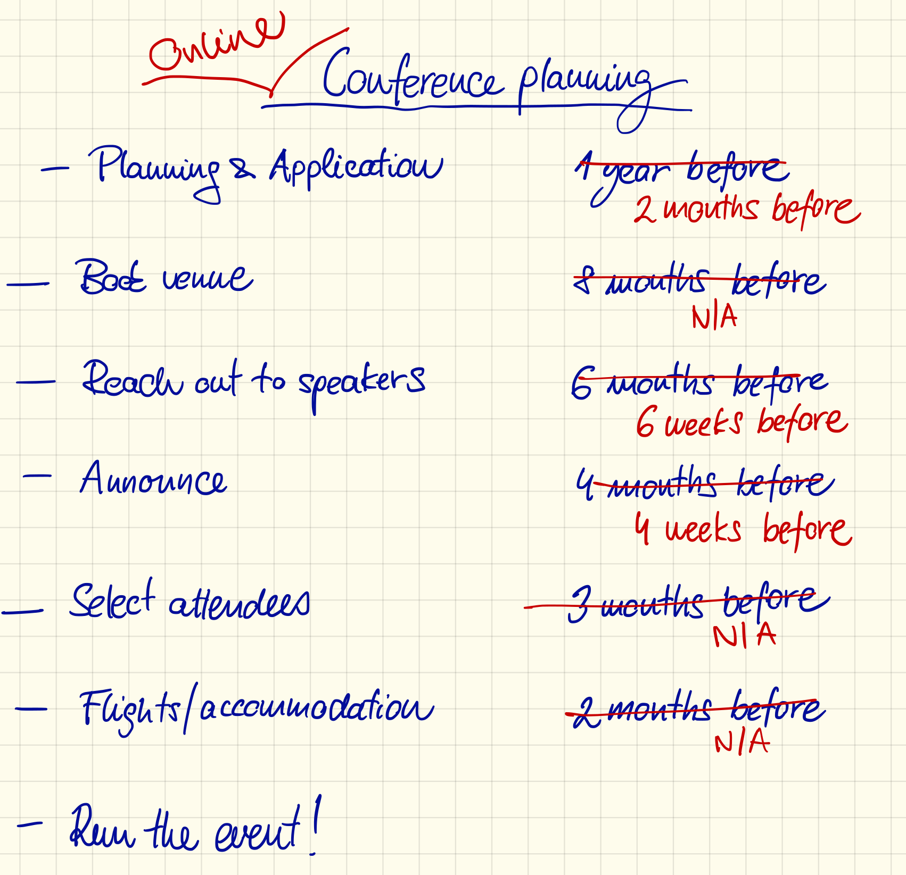

# Let's take this discussion online

<!-- #### COVID lockdown disrupted everyone's work, travel, and likely mean that you attended an online talk. -->

Your routine has changed drastically over the course of the last couple of months due to the lockdowns following the novel coronavirus outbreak.
You now mostly stay at home, hopefully safe and healthy.
Your classes are now taught online, and you probably had to quickly figure out how to run them at all.
If you do experiments, your lab is either closed or operates at a much lower capacity.
Your travel plans are cancelled. Still, despite all this, you have likely attended a scientific presentation or have even given one yourself.
The only difference is that it happened online, perhaps as part of a virtual conference.

<!-- #### Online talks were gaining momentum already before, and for a good reason. -->

Virtual conferences were gaining momentum even before the coronavirus crisis due to multiple advantages over traditional in-person gatherings.
With the increasing concerns about greenhouse emissions, many prefer to limit their long-distance travel.
For some community members with limited mobility, either for family, health, or budget reasons, traditional conferences are off limits altogether, and online events are the only available option.
Finally, most of the expensive and time-consuming aspects of conference organisation, such as finding a venue, lodging and catering for the participants are gone entirely.
With planning and logistics out of the way, virtual conferences can be organized much faster and respond to the latest developments.
They are also more inclusive and reach a broader audience especially if the talks are recorded.

**Figure caption:** A conference organizer checklist.

<!-- #### We decided to develop online conferences and established VSF. -->

The idea of organizing virtual conferences brought us together—a group of geographically and academically diverse physics researchers.
We started exploring the opportunities and challenges of online conferences in late Summer 2019, well before the COVID-19 pandemic.
We decided to keep our organization open for anyone to join, and all of our documentation and notes were public from the very beginning, with the thought that these should benefit anyone trying to work towards the same goal.
After several discussions we committed to developing a community platform for online conferences, which we now call the [Virtual Science Forum](https://virtualscienceforum.org).

<!-- #### In thinking about online events we had to revisit many assumptions about conferences. -->

Once we started brainstorming online events, we realized, that despite those are similar to regular scientific meetings, a lot of our assumptions about conferences do not hold anymore.
For example, the interactions between the speaker and the audience as well as among the audience themselves in an online event are quite different and much less spontaneous. 
As a speaker, for example, gauging the audience's reaction is much harder due to the lack of visual and audio contact -- most participants will have their audio muted and their video turned off. 
This in turn makes setting the atmosphere more difficult, not knowing whether potential jokes were a success or not.
To alleviate some of these challenges and to act as a catalyst between the audience and the speaker, one or multiple moderators are designated to keep an eye out for questions and relay those to the speaker.
The coffee break, such a natural part of in-person conferences, does not function effectively in an online event to spark discussions.
Likewise, the length of an online event is constrained by very different factors, such as the spread of timezones, local commitments and distractions of the participants.

<!-- #### We ran a couple of events, and saw that they work well. -->

We created toolkits and developed strategies and guidelines to navigate these challenges.
Once we felt sufficiently confident, we ran an trial workshop with our direct colleagues as both speakers and the audience.
We used this test run to try out different formats of accommodating interaction between the audience and the speaker, check out unexpected technical problems, and collect the impressions from a broader group of colleagues.
More importantly, however, we observed that videoconferencing has now matured to accommodate high quality live talks, where every viewer gets the front row experience.
Some of our attendees planned their own "watching parties" with a number of participants viewing as a group that pre-discussed their questions and afterwards shared them with the speaker.
Overall we received overwhelmingly positive feedback from all participants.

With this experience, we were ready to hit the ground running and managed to organize a virtual session within only a few days after the APS March Meeting was cancelled.
We are now organizing the biweekly VSF Long Range Colloquium series.
We also actively welcome community initiatives for organizing virtual conferences using our platform, and are excited to already have the first of such conference applications in progress.
Our experience shows that, with a fresh perspective, online conferences can work well to bring researchers together and communicate their work effectively.

<!-- #### We are confident that we will see an explosive growth of online events. -->

With more and more people getting used to online meetings and seminars -- and with online conferencing software continually improving -- we expect and hope that online events keep growing. 
Not because of our platform; but because they allow for broad, easy accessibility and because of their potential contribution to reducing carbon emission.
While the recent public health situation has pushed us toward creating new avenues to establish effective online communications, the advantages and engagement we are seeing go well beyond the crisis situation.
Broad adoption of online events will lead to increased interconnectedness and accessibility of science in general.

<!-- #### Because of how easy it is, many are working towards this goal. -->

Our effort towards online conferences was not the first and is certainly no longer one of few.
Online colloquia and seminars are organized by many science departments and research institutes.
Virtual workshops and conferences are also on the rise, although at a lower rate due to requiring more coordination and planning.
We also expect to see more organizations like [researchseminars.org](https://researchseminars.org) that distribute announcements in order to help navigate the rapidly growing volume of online events.

<!-- #### You should definitely get involved in the online events, and we are here to help. -->

Online conferencing is emerging right now because there are no alternatives until the pandemic is over, lockdowns are lifted, and travel is restored.
While our hands are forced now, we hope that the research community will grow accustomed to this long overdue change and will see the value of virtual conferences in their own right.
This is why we conclude with a call to action: give virtual conferences a shot!
Start with attending the events you like: it has never been easier.
Or perhaps you have an idea for a good event to run?
In that case, now is your chance: go for it, and know that we are here to help!
